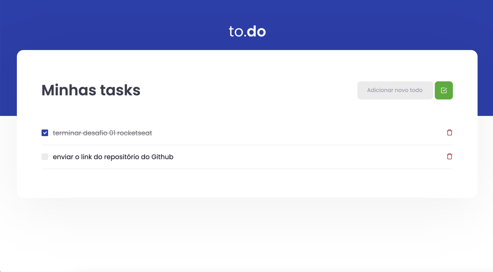

<h1 align="center">
  
</h1>

 

  

## 🚀 Tecnologias

Esse projeto foi desenvolvido com as seguintes tecnologias:

- HTML
- SCSS
- JavaScript
- TypeScript
- NodeJS
- React

## 💻 Projeto

O to.do é uma aplicação de para a organização de tarefas com a possibilidade de cadastrar novas atividades, marcar como feitas e excluí-las. Esse projeto foi o primeiro desafio do Ignite ReactJS da Rocketseat.
